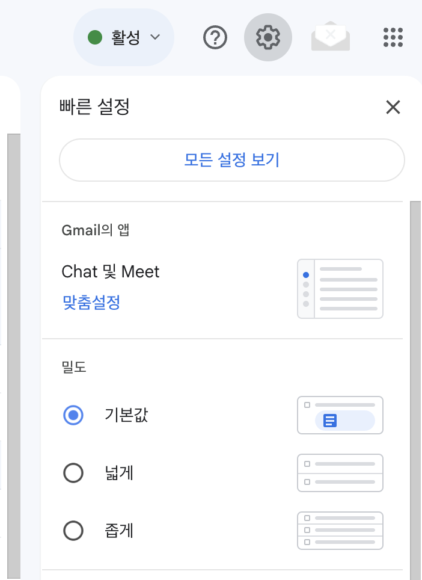
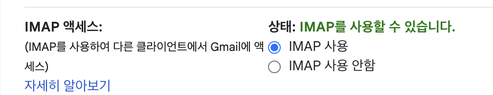
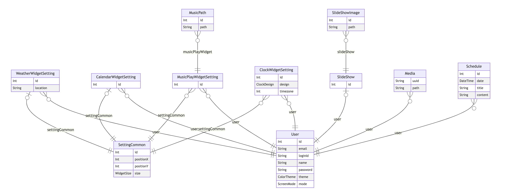
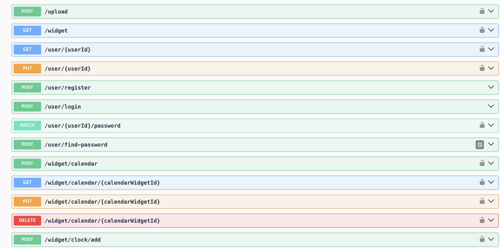

# KNU Capstone Design Project 1 Backend Repository

## Tech Stack

<div align="center">


</div>

## Server Setup

The project uses **Yarn 4.5.0** as its package manager, managed as a `.cjs` file in `.yarn/releases`. It requires Node.js version **18 or higher**, and has been tested with version **22.5.1**.

### Environment Variables

Before running the project, you need to create an `.env` file in the project root. An example `.env` file is provided as `example.env`. Below are the descriptions of the environment variables:

- **PORT**: Port number on which the server will run. Ensure proper port forwarding in your firewall or router.
- **DATABASE_URL**: URL for accessing the PostgreSQL database.
- **PASSWORD_ROUND**: Integer value used for password hashing. A value between 1 and 100 is recommended.
- **JWT_SECRET**: String used for generating JWT tokens. Use a secure and non-obvious value.
- **MAIL_USER**: The email address used for sending emails in the password recovery API. Configuration details are provided below.
- **MAIL_PASSWORD**: The password associated with the email account specified in `MAIL_USER`.

### Email Configuration

The `find_password` API works by sending emails. The following instructions explain how to configure a Gmail account:



1. Log in to your Gmail account, click the gear icon at the top right, and select "See all settings."



2. Navigate to the **Forwarding and POP/IMAP** tab, enable IMAP access, and save the changes.

Set your Gmail address as the value for the `MAIL_USER` environment variable.


3. Go to your Google Account settings and search for **App Passwords**. Generate an app password for Gmail. Copy the 16-character password and set it as the value for the `MAIL_PASSWORD` environment variable.

### Database Configuration

Ensure that the database is accessible using the `DATABASE_URL` environment variable. It is recommended to use Docker and Docker Compose for setting up PostgreSQL. Below is an example `docker-compose.yml` file for configuring the database:

```yml
services:
  db:
    image: postgres:17
    container_name: postgres
    restart: always
    ports:
      - '40001:5432'
    environment:
      - POSTGRES_PASSWORD=password
    volumes:
      - ./data/postgres/:/var/lib/postgresql/data
```

- **image**: Specifies the PostgreSQL image version (17).
- **container_name**: The name of the container. You can set this to any value.
- **restart**: Ensures the container always restarts, even after a server reboot.
- **ports**: Maps the container’s PostgreSQL port (5432) to a port on the host machine.
- **environment**: Sets the environment variables for the PostgreSQL image, including the database password.
- **volumes**: Maps a local directory to the container’s PostgreSQL data directory.

For more details on the PostgreSQL Docker image, visit the [official documentation](https://hub.docker.com/_/postgres).

If you prefer not to use Docker, you can set up PostgreSQL locally, but the `DATABASE_URL` environment variable must still ensure proper connectivity.

### Install Project Dependencies

After completing all configurations, run the following command to install project dependencies:

```bash
$ yarn install
```

### Compile and Run the Project

Use one of the following commands to run the project. The server will use the port specified in the `PORT` environment variable.

```bash
# development
$ yarn run start

# watch mode
$ yarn run start:dev

# production mode
$ yarn run start:prod
```

## ER Diagram

The project uses PostgreSQL as the database and Prisma as the ORM. The schema definition can be found in `prisma/schema.prisma`. Below is the ER diagram generated from this schema:



## API Documentation

API documentation is managed using **Swagger**. The Swagger module in NestJS is used for API testing and documentation. Contributions for missing documentation are welcome.

You can access the API documentation by visiting `/document` after starting the project.



## License

This project is licensed under the MIT License. [MIT licensed](https://github.com/KNU-LG/backend/blob/main/LICENSE).

# KNU 종합설계프로젝트1 백엔드 레포지토리

## 기술 스택

<div align="center">


</div>

## 서버 설정 방법

프로젝트 패키지 매니저는 yarn 4.5.0을 사용합니다. 이는 .yarn/releases에 cjs파일로 관리합니다. node 버전은 최소 v18이상에서 실행되며 테스팅 완료된 버전은 v22.5.1입니다.

### 환경변수

프로젝트를 실행하기 전 .env파일을 프로젝트 루트에 만들어줘야 합니다. 예시로 작성된 환경변수 파일은 example.env에 있습니다. 각 변수에 대한 설명은 아래와 같습니다.

- PORT - 프로젝트가 실행될 서버의 포트 번호입니다. 방화벽 혹은 공유기의 포트 포워드 설정을 확인 해 주세요.
- DATABASE_URL - 프로젝트는 postgresql을 사용합니다. 이 변수값으로 postgresql에 접근할 수 있어야 합니다.
- PASSWORD_ROUND - 비밀번호 해쉬값에 사용되는 정수값입니다. 1~100사이의 임의의 값을 추천합니다.
- JWT_SECRET - JWT 토큰을 만들 때 사용되는 문자열입니다. 다른 사람이 유추하기 어려운 비밀번호를 넣어주세요.
- MAIL_USER - 비밀번호 찾기 API는 내부적으로 메일을 보내는 방식으로 작동합니다. gmail을 기준으로 하는 설정 방법은 밑에서 설명합니다.
- MAIL_PASSWORD - MAIL_USER와 마찬가지로 메일을 보낼 때 사용하는 비밀번호입니다.

### 메일 설정

find_password API는 메일을 보내는 방식으로 동작합니다. 다음은 gmail을 기준으로 메일 아이디를 설정하는 방법입니다.


먼저, gmail에 로그인한 뒤 우측 상단 톱니바퀴 버튼을 누른 후 모든 설정 보기 버튼을 눌러서 설정 화면에 진입합니다.


전달 및 POP/IMAP 탭에 들어가서 IMAP 사용 설정을 IMAP 사용으로 하고 저장합니다.

환경 변수 MAIL_USER에 세팅을 한 계정의 gmail의 메일 주소를 입력합니다.


google 계정 설정에서 앱 비밀번호를 검색해 들어갑니다.

앱 이름을 설정하고 앱 비밀번호 생성버튼을 누르면 16자리 알파벳이 생성되는데 이 값을 환경변수 MAIL_PASSWORD에 설정합니다.

### DB 설정

환경변수에 설정된 db url을 통해 postgresql을 접근할 수 있어야 합니다. 추천하는 방법은 docker와 docker-compose를 사용하는 방법입니다. 아래 내용은 docker-compose.yml를 통해 DB를 설정하는 방법입니다.

```yml
services:
  db:
    image: postgres:17
    container_name: postgres
    restart: always
    ports:
      - '40001:5432'
    environment:
      - POSTGRES_PASSWORD=password
    volumes:
      - ./data/postgres/:/var/lib/postgresql/data
```

위 파일은 docker-compose.yml의 예시입니다.

- image - postgres 17버전을 사용합니다
- container_name - 컨테이너 이름입니다. 임의로 지어주면 됩니다.
- restart: always - 서버가 재부팅 된 상황에서도 항상 실행하게 재시작 옵션을 줍니다.
- ports - postgresql이 실행될 포트 번호입니다. 앞 숫자는 실제 서버의 포트, 뒤 숫자는 도커 내부 포트(5432 고정)을 의미합니다.
- environment - postgres 이미지에 대한 환경변수 설정값입니다. 비밀번호를 설정하면 됩니다.
- volumes - docker 내부 파일 시스템과 서버의 파일 시스템을 연결합니다.

postgres 이미지에 대한 더 자세한 설명은 [https://hub.docker.com/\_/postgres](https://hub.docker.com/_/postgres)에서 확인할 수 있습니다.

docker를 사용하지 않고 로컬에 postgresql를 설정해도 됩니다. 프로젝트 환경변수 중 DATABASE_URL을 통해 postgresql에 접근 가능함이 보장되어야 합니다.

### 프로젝트 의존성 설치

모든 설정을 완료했으면 다음 명령어를 통해 프로젝트 의존성을 설치해야합니다.

```bash
$ yarn install
```

### Compile and run the project

다음 명령어중 하나로 프로젝트를 실행할 수 있으며 프로젝트는 환경 변수 PORT값에 적힌 포트번호를 사용합니다.

```bash
# development
$ yarn run start

# watch mode
$ yarn run start:dev

# production mode
$ yarn run start:prod
```

## ER Diagram

DB는 postgresql을 사용하고 orm으로 prisma를 사용합니다. schema 정의는 prisma/schema.prisma 파일에 있습니다. 다음 그림은 이 파일로 만들어지는 DB의 다이어그램입니다.


## API 문서

API문서는 swagger로 관리합니다. nestjs의 swagger 모듈을 활용해 API 테스팅 및 문서화를 진행합니다. 빠진 문서의 컨트리뷰션 또한 환영합니다.

프로젝트 실행 시 /document로 접근하면 API 문서 내용을 확인할 수 있습니다.


## License

프로젝트는 MIT 라이선스입니다. [MIT licensed](https://github.com/KNU-LG/backend/blob/main/LICENSE)
